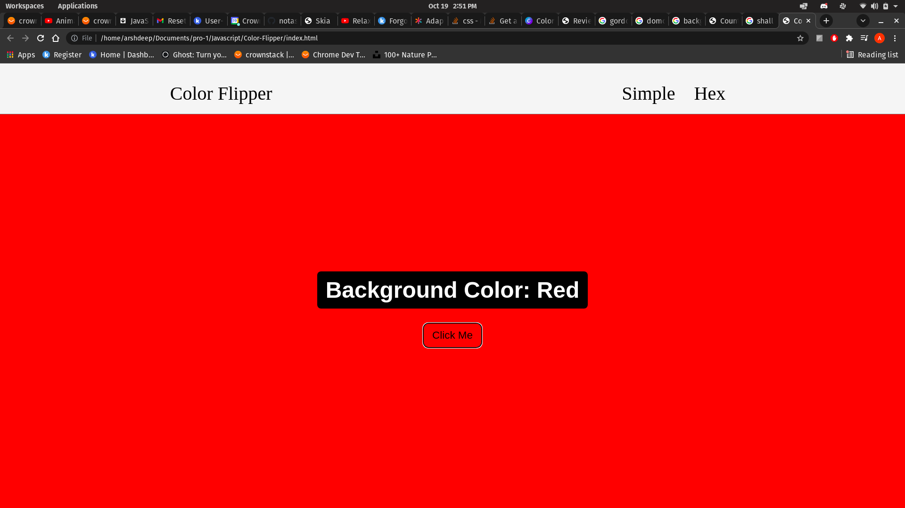
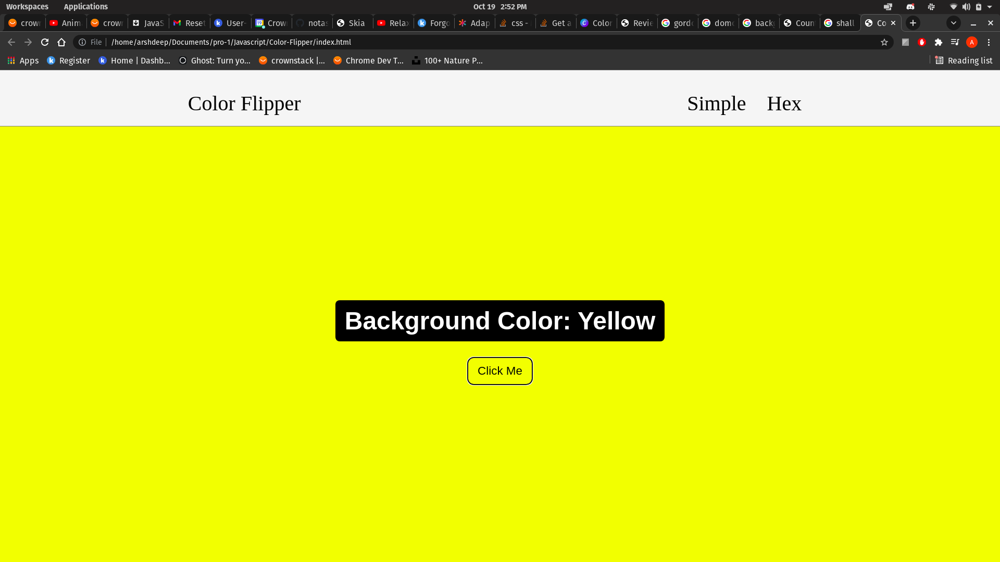
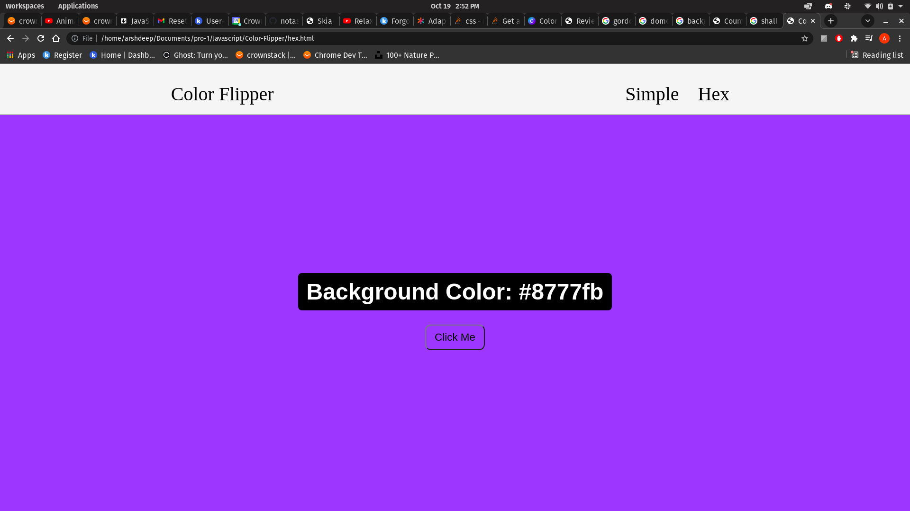
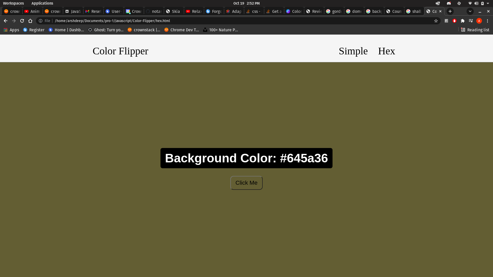
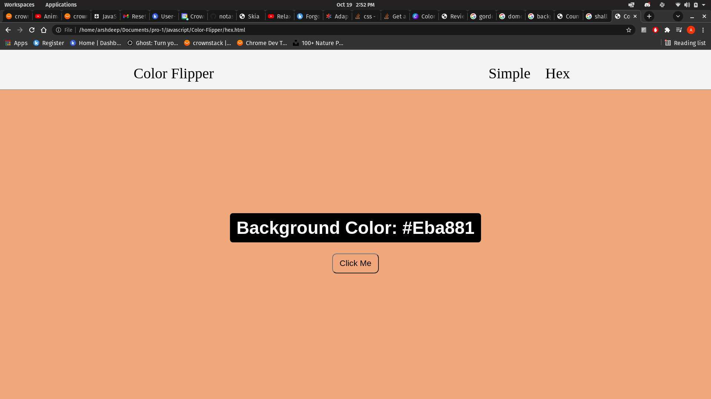
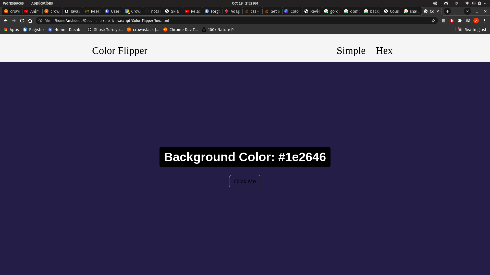
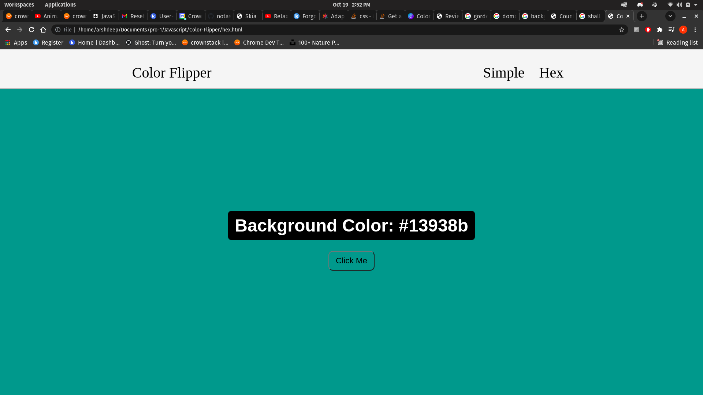

# Color-Flipper

### There are 2 parts to this project, the simple part which will show you random VIBGYOR colors and the HEX part that will show you random colors of different HEX code with all the possible combination.

## The screenshots of the project are added below 

 

 

 

 

 

 

 

 

 

 

 

 

 

 
